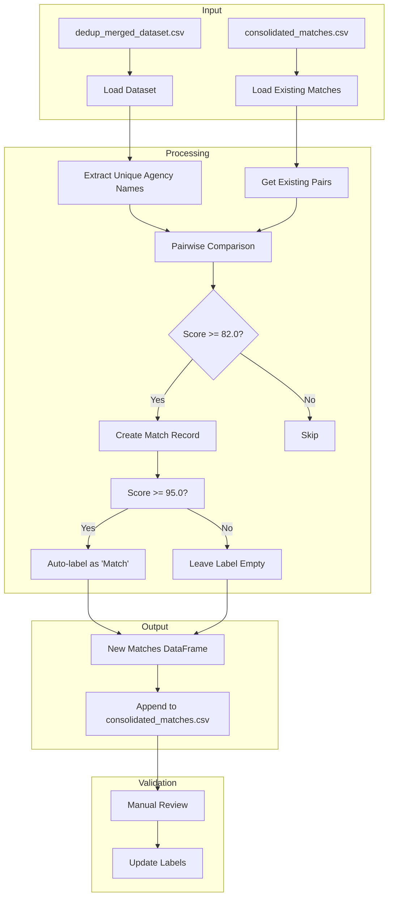

# Step 3.1: Potential Match Generation

## Overview
This step generates potential matches between agency names using enhanced fuzzy matching techniques and appends new matches to the consolidated matches file.

## Data Flow Diagram

## Components

### Input Files
- `dedup_merged_dataset.csv`: Contains deduplicated agency records
- `consolidated_matches.csv`: Existing match pairs with labels

### Key Functions
1. **load_dedup_dataset()**
   - Loads deduplicated dataset
   - Returns DataFrame with agency records

2. **load_existing_matches()**
   - Loads existing match pairs
   - Creates empty DataFrame if file doesn't exist
   - Columns: Source, Target, Score, Label, SourceID, TargetID

3. **get_existing_pairs()**
   - Creates set of existing source-target pairs
   - Adds both directions to prevent duplicates
   - Normalizes to lowercase for comparison

4. **generate_potential_matches()**
   - Uses EnhancedMatcher for fuzzy matching
   - Applies NYC-specific patterns and rules
   - Filters matches below 82.0 score
   - Auto-labels matches >= 95.0 score
   - Tracks RecordIDs for provenance

5. **save_matches()**
   - Sorts matches by score (descending)
   - Appends to consolidated_matches.csv
   - Preserves header structure

### Matching Process
1. Extract unique agency names from deduplicated dataset
2. Compare each pair of names (excluding existing pairs)
3. Calculate similarity score using EnhancedMatcher
4. Filter matches:
   - Keep if score >= 82.0
   - Auto-label if score >= 95.0
5. Track match metadata:
   - Source and Target names
   - Score (rounded to 1 decimal)
   - Label (auto-filled or empty)
   - Source and Target RecordIDs

### Output
- Appends new matches to `consolidated_matches.csv`
- Each match includes:
  - Source agency name
  - Target agency name
  - Similarity score
  - Label (auto-filled for high confidence matches)
  - Source and Target RecordIDs

### Validation
- Manual review of generated matches
- Update labels based on human verification
- Labels:
  - "Match": Confirmed match
  - "No Match": Confirmed non-match
  - Empty: Awaiting review

## Statistics
- Input Records: 706 unique agency names
- Comparisons: 248,865 pairs
- New Matches: 127 potential matches
- Score Distribution:
  - Perfect (100): Multiple exact matches after normalization
  - High (95-99): Common variations (e.g., "and" vs "&")
  - Medium (82-94): Requires manual review 