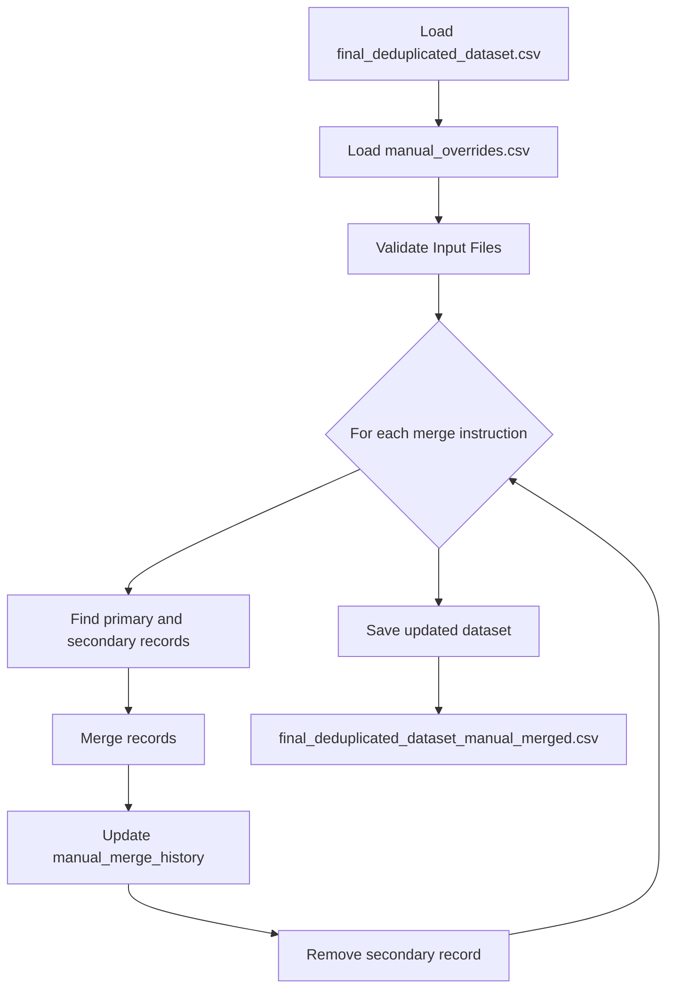

# Step 2.6: Manual Merge Process

## Overview
This step applies manual merge instructions to handle special cases in the final deduplicated dataset that require human intervention. The process reads a CSV file containing manual merge instructions and applies them to merge specific records while preserving important information from both records.

## Input Files
- `data/processed/final_deduplicated_dataset.csv`: The final deduplicated dataset containing all records
- `data/manual_overrides.csv`: Manual merge instructions specifying which records to merge
  - Required columns:
    - `PrimaryRecordID`: The RecordID of the record to keep
    - `SecondaryRecordID`: The RecordID of the record to merge into the primary

## Process Flow

## Merge Logic
1. Keep primary record's Name field unchanged
2. For each other field (except RecordID and Name):
   - If primary is blank and secondary has value, update primary
3. Special handling for Acronym field:
   - If secondary has Acronym, add to primary's AlternateAcronyms
   - If AlternateAcronyms blank, set to secondary's Acronym
   - If populated, append with "; " separator
4. Update manual_merge_history on primary to record merged RecordID
5. Remove secondary record from dataset

## Output Files
- `data/processed/final_deduplicated_dataset_manual_merged.csv`: Updated dataset with manual merges applied
  - Contains all original fields
  - Updated AlternateAcronyms where applicable
  - New manual_merge_history field tracking merged records
  - Secondary records removed after merging

## Statistics & Validation
- Total merge instructions processed
- Successful merges completed
- Failed merges (with error details)
- Records in final dataset
- Validation checks:
  - Input files exist and have required columns
  - Records referenced in merge instructions exist
  - No duplicate RecordIDs in output
  - All manual_merge_history entries properly formatted

## Error Handling
- Validates input files before processing
- Logs detailed error messages for failed merges
- Continues processing remaining instructions if one fails
- Maintains audit trail of all operations

## Dependencies
- Python 3.x
- pandas
- pathlib
- logging

## Notes
- Manual merge instructions should be carefully reviewed before processing
- Process is idempotent - can be run multiple times safely
- Preserves all source data while consolidating records
- Maintains clear audit trail of merge operations 