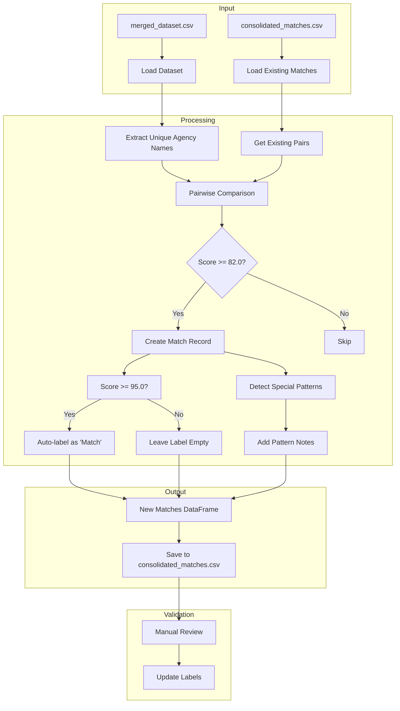

# Step 3.1: Potential Match Generation

## Overview
This step generates potential matches between agency names using enhanced fuzzy matching techniques and appends new matches to the consolidated matches file. The process includes special pattern detection and documentation to assist with manual review.

## Data Flow Diagram

## Components

### Input Files
- `merged_dataset.csv`: Contains deduplicated agency records
- `consolidated_matches.csv`: Existing match pairs with labels and notes

### Key Functions
1. **load_dedup_dataset()**
   - Loads deduplicated dataset from `data/intermediate/`
   - Returns DataFrame with agency records
   - Handles missing file errors

2. **load_existing_matches()**
   - Loads existing match pairs
   - Creates empty DataFrame if file doesn't exist
   - Columns: Source, Target, Score, Label, SourceID, TargetID, Notes

3. **get_existing_pairs()**
   - Creates set of existing source-target pairs
   - Adds both directions to prevent duplicates
   - Normalizes to lowercase for comparison

4. **generate_potential_matches()**
   - Uses EnhancedMatcher for fuzzy matching
   - Applies NYC-specific patterns and rules
   - Filters matches below 82.0 score
   - Auto-labels matches >= 95.0 score
   - Detects and documents special patterns
   - Tracks RecordIDs for provenance

5. **save_matches()**
   - Sorts matches by score (descending)
   - Preserves existing matches
   - Ensures Notes column exists
   - Saves combined matches to CSV

### Special Cases & Patterns
1. **Borough Variations**
   - Example: "Brooklyn Public Library" vs "Public Library - Brooklyn"
   - Detects borough names: Brooklyn, Queens, Bronx, Manhattan, Staten Island

2. **Mayor's Office Variations**
   - Example: "Mayor's Office of X" vs "Office of X"
   - Tracks variations in mayoral office naming

3. **Organization Type Variations**
   - Detects variations in department/board/commission naming
   - Example: "Department of X" vs "X Department"

4. **Acronym Matches**
   - Example: "DCAS" vs "Department of Citywide Administrative Services"
   - Identifies potential acronym usage

5. **Community Board Patterns**
   - Tracks community board naming variations
   - Helps identify district numbering patterns

### Matching Process
1. Extract unique agency names from deduplicated dataset
2. Compare each pair of names (excluding existing pairs)
3. Calculate similarity score using EnhancedMatcher
4. Filter matches:
   - Keep if score >= 82.0
   - Auto-label if score >= 95.0
5. Document special patterns in Notes field
6. Track match metadata:
   - Source and Target names
   - Score (rounded to 1 decimal)
   - Label (auto-filled or empty)
   - Source and Target RecordIDs
   - Pattern notes

### Output
- Appends new matches to `consolidated_matches.csv`
- Each match includes:
  - Source agency name
  - Target agency name
  - Similarity score
  - Label (auto-filled for high confidence matches)
  - Source and Target RecordIDs
  - Notes about detected patterns

### Validation
- Manual review of generated matches
- Update labels based on human verification
- Labels:
  - "Match": Confirmed match
  - "No Match": Confirmed non-match
  - Empty: Awaiting review
- Use pattern notes to guide review process

## Statistics
- Input Records: ~658 unique agency names
- Comparisons: ~216,000 potential pairs
- Typical Results:
  - Perfect (100): Multiple exact matches after normalization
  - High (95-99): Common variations (e.g., "and" vs "&")
  - Medium (82-94): Requires manual review with pattern guidance 