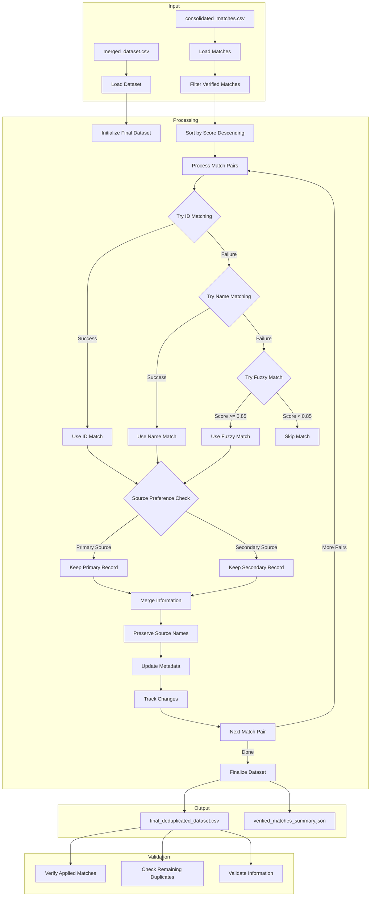

# Step 3.2: Apply Verified Matches

## Overview
This step uses manually verified matches from `consolidated_matches.csv` to perform a second round of deduplication on the dataset, preserving source-specific names and maintaining a detailed audit trail. The process includes both deterministic (ID-based) and fuzzy name matching strategies.

## Data Flow Diagram


## Components

### Input Files
1. `merged_dataset.csv`
   - Output from Step 2.2 (initial deduplication)
   - Contains records with standard fields and metadata
   - Includes source tracking and merge history

2. `consolidated_matches.csv`
   - Output from Step 3.1 with manual verification
   - Contains columns:
     - Source, Target (agency names)
     - Score (similarity score)
     - Label ("Match" or "No Match")
     - SourceID, TargetID (record identifiers)

### Key Functions

1. **load_and_validate_inputs()**
   - Load deduplicated dataset
   - Load and filter verified matches
   - Validate all required fields exist
   - Initialize source-specific name fields
   - Return validated DataFrames

2. **normalize_name_for_matching()**
   - Generate multiple normalized versions of a name
   - Handle common abbreviations (dept -> department, etc.)
   - Create variations with different word orders
   - Remove punctuation and standardize spacing

3. **find_matching_record()**
   - Try exact matches on normalized names first
   - Fall back to fuzzy matching if needed
   - Use similarity threshold (0.85)
   - Return best matching record(s)

4. **process_verified_matches()**
   - Sort matches by score descending
   - For each verified match:
     - Try ID matching first
     - Fall back to name/fuzzy matching if needed
     - Apply source preference rules
     - Merge information
     - Update metadata
   - Return processed dataset

5. **merge_record_information()**
   - Start with preferred record
   - Preserve source-specific name fields (Name - HOO, Name - Ops)
   - Preserve non-null values from secondary record
   - Track preserved fields

6. **update_record_metadata()**
   - Update merged_from list
   - Add merge notes with preserved fields
   - Track source of each field
   - Update deduplication metadata

### Processing Rules

1. **Source Preference**
   - Follow established hierarchy:
     1. nyc_agencies_export (primary)
     2. ops
     3. nyc_gov
   - Consider match score in decisions

2. **Information Preservation**
   - Keep all non-null values
   - Preserve source-specific name fields
   - Track source of each field
   - Maintain arrays for multiple values
   - Preserve unique identifiers

3. **Name Matching Strategy**
   1. Try ID matching first
   2. Try exact name matching on normalized variations
   3. Fall back to fuzzy matching with 0.85 threshold
   4. Skip if no match found

4. **Metadata Updates**
   - Record all merged RecordIDs
   - Note which fields came from where
   - Track merge decisions and methods
   - Update provenance information

### Current Statistics (as of latest run)
- Input Records: 658
- Final Records: 355
- Merged Records: 303
- Match Processing:
  - Total Matches: 823
  - Successfully Applied: 253
    - By ID: 207
    - By Fuzzy (>=0.85): 46
    - By Exact Name: 0
  - Records Not Found: 570
- Source-Specific Names:
  - Name - Ops preserved: 413
  - Name - HOO preserved: 177

### Output Files

1. **final_deduplicated_dataset.csv**
   - Fully deduplicated records
   - All preserved information
   - Complete metadata columns
   - Source-specific name fields:
     - Name - Ops
     - Name - HOO
   - Updated source tracking

2. **verified_matches_summary.json**
   ```json
   {
     "total_matches": 823,
     "matches_applied": 253,
     "records_affected": ["RecordID1", "RecordID2", ...],
     "match_method": {
       "by_id": 207,
       "by_name": 0,
       "by_fuzzy": 46
     },
     "skipped_matches": {
       "missing_ids": 0,
       "already_processed": 0,
       "records_not_found": 570
     }
   }
   ```

### Validation Points

1. **Match Application**
   - Verify ID matches were attempted first
   - Confirm fuzzy matches meet threshold
   - Validate source preferences were followed

2. **Information Preservation**
   - Source-specific names are preserved:
     - Name - Ops maintained for OPS records
     - Name - HOO maintained for HOO records
   - No critical data was lost
   - Field values were properly combined
   - Empty rows are properly handled

3. **Metadata Integrity**
   - RecordIDs properly tracked
   - Merge history is complete
   - Match methods are logged
   - Provenance is maintained

4. **Data Quality**
   - No unintended duplicates
   - Required fields present
   - Consistent formatting
   - No empty rows in final output 